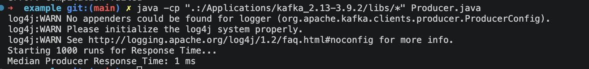
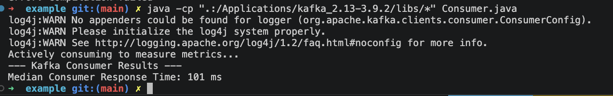
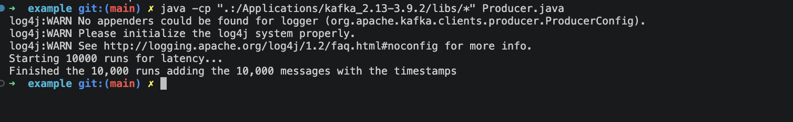
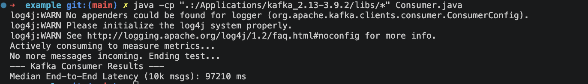

habiba marwan 8855<br>shahd yasser 8748

<h1 align="center"> JMS VS KAFKA lab</h1>


# Apache kafka

## Usability
 - i downloaded kafa (around 30 mins)
 - i ran 2 shell scripts to start the application
**To start the zookeeper**

```sh

bin/zookeeper-server-start.sh config/zookeeper.properties

```

**To start kafka**

```sh

bin/kafka-server-start.sh config/server.properties

```
 - i created a test topic inside kafka called lab-topic
 - created a maven project inside VScode 
 - added the kafka dependencies inside the pom.xml

## Performance Comparison

### Response Time

     
- we measured the response time by sending a 1KB message from the producer a 1000 times , waited till the kafka broker acks the reception of the msg ( made the call sync.) and measured this waiting time 
  
- Got the median response time of the 1000 runs as the producer response time

**Code to test producer's response time**

```java
package com.example;

import org.apache.kafka.clients.producer.*;
import java.util.*;

public class Producer {
    public static void main(String[] args) throws Exception {
        Properties props = new Properties();
        props.put("bootstrap.servers", "localhost:9092");
        // to tell kafka how to convert the message string in java into bytes
        props.put("key.serializer", "org.apache.kafka.common.serialization.StringSerializer");
        // Using ByteArraySerializer to handle the raw 1KB payload
        props.put("value.serializer", "org.apache.kafka.common.serialization.ByteArraySerializer");

        KafkaProducer<String, byte[]> producer = new KafkaProducer<>(props);

        // we will store the response time of each message we write
        List<Long> responseTimes = new ArrayList<>();

        System.out.println("Starting 1000 runs for Response Time...");
        for (int i = 0; i < 1000; i++) {
            byte[] message = new byte[1024];

            // Capture the current time as a String
            long emitTime = System.currentTimeMillis();
            String timeString = String.valueOf(emitTime);
            byte[] timeBytes = timeString.getBytes();

            // Copy the timestamp bytes into the start of our 1KB payload
            System.arraycopy(timeBytes, 0, message, 0, timeBytes.length);

            ProducerRecord<String, byte[]> record = new ProducerRecord<>("lab-topic", "key", message);

            long start = System.currentTimeMillis();
            producer.send(record).get(); // to make the call sync as the kafka default is async
            long end = System.currentTimeMillis();

            responseTimes.add(end - start);
        }

        // sorting to find the median
        Collections.sort(responseTimes);
        System.out.println("Median Producer Response Time: " + responseTimes.get(500) + " ms");
        producer.close();
    }
}
```
**Output**



**Code to test consumer's response time**

```java
package com.example;

import org.apache.kafka.clients.consumer.*;
import java.time.Duration;
import java.util.*;

public class Consumer {
    public static void main(String[] args) {
        Properties props = new Properties();
        props.put("bootstrap.servers", "localhost:9092");
        // as in kafka each consumer must belong to a group
        props.put("group.id", "lab-group-unique"); // Unique group to start from beginning

        // to deserialize the message back into a string
        props.put("key.deserializer", "org.apache.kafka.common.serialization.StringDeserializer");
        props.put("value.deserializer", "org.apache.kafka.common.serialization.ByteArrayDeserializer");
        // setting the consumer offset
        props.put("auto.offset.reset", "earliest"); // Read from the very first message

        KafkaConsumer<String, byte[]> consumer = new KafkaConsumer<>(props);
        consumer.subscribe(Collections.singletonList("lab-topic")); // subscribe to topic

        List<Long> pollResponseTimes = new ArrayList<>();
        // List<Long> latencies = new ArrayList<>();

        System.out.println("Actively consuming to measure metrics...");

        // 10K messages for latency
        // and report median of 1000 runs for response time
        while (pollResponseTimes.size() < 1000) {
            long pollStart = System.currentTimeMillis();
            ConsumerRecords<String, byte[]> records = consumer.poll(Duration.ofMillis(100));
            long pollEnd = System.currentTimeMillis();

            // if (!records.isEmpty()) {
                // Record Poll Response Time (for the first 1000 valid polls)
                // if (pollResponseTimes.size() < 1000) {
                    pollResponseTimes.add(pollEnd - pollStart);
                // }

                // for (ConsumerRecord<String, byte[]> record : records) {
                // byte[] payload = record.value();

                // Extract Timestamp from the 1KB payload
                // We read the bytes until we hit a non-digit or reasonable limit
                // String timeStr = new String(payload).trim();
                // Note: trim() works because the rest of the 1KB array is empty bytes (0)

                // try {
                // long producerTimestamp = Long.parseLong(timeStr.split("[^0-9]")[0]);
                // long currentTimestamp = System.currentTimeMillis();

                // // Calculate Latency
                // latencies.add(currentTimestamp - producerTimestamp);
                // } catch (Exception e) {
                // // Skip if the bytes aren't a valid timestamp
                // }

                // if (latencies.size() >= 10000)
                // break;
                // }
            // }
        }

        // Calculate and Print Medians
        Collections.sort(pollResponseTimes);
        // Collections.sort(latencies);

        System.out.println("--- Kafka Consumer Results ---");
        System.out.println(
                "Median Consumer Response Time: " + pollResponseTimes.get(pollResponseTimes.size() / 2) + " ms");
        // System.out.println("Median End-to-End Latency (10k msgs): " +
        // latencies.get(latencies.size() / 2) + " ms");

        consumer.close();
    }
}
```

**Output**


### Latency

- we measured the latency by sending a 1KB message from the producer  10,000 times , added the current Time stamp to the msg at the producer , so that we can measure the time it took to get to the consumer
  
- Got the median latency of the 10000 runs 

**Code after modifying producer to 10,000 runs instead of 1000**

```java
package com.example;

import org.apache.kafka.clients.producer.*;
import java.util.*;

public class Producer {
    public static void main(String[] args) throws Exception {
        Properties props = new Properties();
        props.put("bootstrap.servers", "localhost:9092");
        // to tell kafka how to convert the message string in java into bytes
        props.put("key.serializer", "org.apache.kafka.common.serialization.StringSerializer");
        // Using ByteArraySerializer to handle the raw 1KB payload
        props.put("value.serializer", "org.apache.kafka.common.serialization.ByteArraySerializer");

        KafkaProducer<String, byte[]> producer = new KafkaProducer<>(props);

        // we will store the response time of each message we write
        // List<Long> responseTimes = new ArrayList<>();

        System.out.println("Starting 10000 runs for latency...");
        for (int i = 0; i < 10000; i++) {
            byte[] message = new byte[1024];

            // Capture the current time as a String
            long emitTime = System.currentTimeMillis();
            String timeString = String.valueOf(emitTime);
            byte[] timeBytes = timeString.getBytes();

            // Copy the timestamp bytes into the start of our 1KB payload
            System.arraycopy(timeBytes, 0, message, 0, timeBytes.length);

            ProducerRecord<String, byte[]> record = new ProducerRecord<>("lab-topic", "key", message);

            long start = System.currentTimeMillis();
            producer.send(record).get(); // to make the call sync as the kafka default is async
            long end = System.currentTimeMillis();

            // responseTimes.add(end - start);
        }

        // sorting to find the median
        // Collections.sort(responseTimes);
        // System.out.println("Median Producer Response Time: " + responseTimes.get(500)
        // + " ms");
        System.out.println("Finished the 10,000 runs adding the 10,000 messages with the timestamps");
        producer.close();
    }
}

```

**Output**


**Consumer's code for latency**

```java
package com.example;

import org.apache.kafka.clients.consumer.*;
import java.time.Duration;
import java.util.*;

public class Consumer {
    public static void main(String[] args) {
        Properties props = new Properties();
        props.put("bootstrap.servers", "localhost:9092");
        // as in kafka each consumer must belong to a group
        props.put("group.id", "lab-group-unique"); // Unique group to start from beginning

        // to deserialize the message back into a string
        props.put("key.deserializer", "org.apache.kafka.common.serialization.StringDeserializer");
        props.put("value.deserializer", "org.apache.kafka.common.serialization.ByteArrayDeserializer");
        // setting the consumer offset
        props.put("auto.offset.reset", "earliest"); // Read from the very first message

        KafkaConsumer<String, byte[]> consumer = new KafkaConsumer<>(props);
        consumer.subscribe(Collections.singletonList("lab-topic")); // subscribe to topic

        List<Long> pollResponseTimes = new ArrayList<>();
        List<Long> latencies = new ArrayList<>();

        System.out.println("Actively consuming to measure metrics...");

        // 10K messages for latency
        // and report median of 1000 runs for response time
        while (pollResponseTimes.size() < 10000) {
            long pollStart = System.currentTimeMillis();
            ConsumerRecords<String, byte[]> records = consumer.poll(Duration.ofMillis(100));
            long pollEnd = System.currentTimeMillis();

            if (records.isEmpty()) {
                // If we have already received SOME messages but now it's empty,
                // the producer is likely done. Break so we can see our results!
                if (latencies.size() > 0) {
                    System.out.println("No more messages incoming. Ending test...");
                    break;
                }
                continue;
            }
            for (ConsumerRecord<String, byte[]> record : records) {
                byte[] payload = record.value();

                // Extract Timestamp from the 1KB payload
                // We read the bytes until we hit a non-digit or reasonable limit
                String timeStr = new String(payload).trim();
                // Note: trim() works because the rest of the 1KB array is empty bytes (0)

                try {
                    long producerTimestamp = Long.parseLong(timeStr.split("[^0-9]")[0]);
                    long currentTimestamp = System.currentTimeMillis();

                    // Calculate Latency
                    latencies.add(currentTimestamp - producerTimestamp);
                } catch (Exception e) {
                    // Skip if the bytes aren't a valid timestamp
                }

                if (latencies.size() >= 10000)
                    break;
            }

        }

        // Calculate and Print Medians
        Collections.sort(pollResponseTimes);
        Collections.sort(latencies);

        System.out.println("--- Kafka Consumer Results ---");
        // System.out.println(
        // "Median Consumer Response Time: " +
        // pollResponseTimes.get(pollResponseTimes.size() / 2) + " ms");
        System.out.println("Median End-to-End Latency (10k msgs): " +
                latencies.get(latencies.size() / 2) + " ms");

        consumer.close();
    }
}

```

**Output**



# JMS – Apache ActiveMQ
## Overview
This part evaluates the performance of Java Message Service (JMS) using Apache ActiveMQ as the message broker. The following performance aspects were measured:

- Response Time for Producer API
- Response Time for Consumer API
- Maximum Throughput
- Median Latency between message production and consumption

The implementation was developed in Java using the JMS API and ActiveMQ.

---

# Technologies Used

- Java 11
- Apache ActiveMQ
- JMS API (`javax.jms`)
- Maven
- Apache JMeter (for throughput testing)

---

# Project Structure

```text
src/main/java/com/jms/

    Producer.java
    Consumer.java

message.txt
```

---

# ActiveMQ Setup

## Start ActiveMQ Broker

Open terminal inside:

```text
apache-activemq/bin
```

Run:

```bash
activemq start
```

Broker URL used throughout the project:

```text
tcp://localhost:61616
```

---

# Queue Names


Response Time: broker-queue3
Latency Benchmark | latency-queue1

---

## 1- Responce Time

# Producer Response Time

## Objective
Measure the response time of the JMS produce API which is how long the producer API takes to send a message to the broker

## Method
- 1000 messages were produced.
- Each message size was 1KB.
- Time before and after `producer.send()` was measured.
- Median response time was calculated.

## Some Response time obtained from the produser:
-Msg Sent 0 : 5 ms
-Msg Sent 3 : 10 ms
-Msg Sent 67 : 7 ms
-Msg Sent 95 : 0 ms
-Msg Sent 125 : 7 ms
-Msg Sent 130 : 2 ms
-Msg Sent 132 : 0 ms
-Msg Sent 360 : 34 ms
-Msg Sent 990 : 1 ms
-Msg Sent 991 : 0 ms
-Msg Sent 992 : 0 ms
-Msg Sent 993 : 0 ms
-Msg Sent 994 : 0 ms
-Msg Sent 995 : 5 ms
-Msg Sent 996 : 2 ms
-Msg Sent 997 : 1 ms
-Msg Sent 998 : 0 ms
-Msg Sent 999 : 1 ms
Median Producer Response Time = 0 ms

# Consumer Response Time

## Objective
Measure the response time of the JMS consume API which is how long the consumer API takes to receive a message from the broker

## Method
- 1000 messages were consumed.
- Time before and after `consumer.receive()` was measured.
- Median response time was calculated.

## Some Response time obtained from the consumer:
Receive 0 = 8906 ms
Receive 1 = 0 ms
Receive 2 = 0 ms
Receive 3 = 0 ms
Receive 6 = 0 ms
Receive 7 = 0 ms
Receive 8 = 3 ms
Receive 165 = 7 ms
Receive 166 = 0 ms
Receive 167 = 0 ms
Receive 168 = 0 ms
Receive 169 = 0 ms
Receive 170 = 0 ms
Receive 171 = 7 ms
Receive 172 = 1 ms
Receive 990 = 0 ms
Receive 991 = 1 ms
Receive 992 = 0 ms
Receive 993 = 0 ms
Receive 994 = 0 ms
Receive 995 = 0 ms
Receive 996 = 5 ms
Receive 997 = 2 ms
Receive 998 = 0 ms
Receive 999 = 1 ms
Median Consume Response Time = 0ms
---

# 2- Maximum Throughput

## Objective
Measure the maximum number of successful messages processed per second.

### Producer Throughput Observation

During throughput benchmarking, increasing the target throughput beyond a certain value did not significantly increase the actual achieved throughput. For example, when testing a target throughput of 900000 messages/sec, the actual throughput stabilized around 16500 messages/sec with zero failed requests.

This indicates that the system reached its practical throughput saturation point. At very high target rates, JVM scheduling overhead, ActiveMQ processing capacity, operating system thread scheduling, and Java timing limitations (`Thread.sleep`) became the bottleneck rather than the configured target throughput itself.

Therefore, the maximum practical producer throughput on the test environment was approximately 16K–18K messages/sec for 1KB messages using non-persistent delivery mode on localhost.


### Consumer Throughput Observation
At high target throughput values, the actual throughput saturated around 15K messages/sec due to JVM scheduling limitations, ActiveMQ processing capacity, and operating system timing granularity. Increasing the target throughput beyond this value did not significantly improve the actual achieved throughput.


# 4. Median Latency

## Objective
Measure end-to-end delay introduced by the messaging system.

## Method

1. Consumer started first and continuously listened for messages.
2. Producer attached a send timestamp to each message.
3. Consumer retrieved timestamp upon message reception.
4. Latency was computed for 10,000 messages.
5. Median latency was calculated.


# JMS Usability Evaluation

## Tool Setup Overhead

### ActiveMQ Installation and Configuration
Setting up JMS using Apache ActiveMQ required the installation and configuration of the following before writing any application code.

The setup process included:
- Installing Java JDK 11
- Installing Maven
- Downloading and extracting Apache ActiveMQ
- Starting the ActiveMQ broker manually using:
  
```bash
activemq start
```

- Verifying broker availability through:
  
```text
tcp://localhost:61616
```

- Accessing the ActiveMQ dashboard through:
  
```text
http://localhost:8161
```

### Maven Dependency Configuration

The project required manual configuration of Maven dependencies inside `pom.xml`, including:
- `activemq-client`
- `javax.jms-api`

Example:

```xml
<dependency>
    <groupId>org.apache.activemq</groupId>
    <artifactId>activemq-client</artifactId>
    <version>5.19.6</version>
</dependency>
```

### Compatibility Issues

Several compatibility issues were encountered during setup:
- Version mismatch between Java runtime and ActiveMQ client libraries
- Differences between `jakarta.jms` and `javax.jms`
- Maven dependency conflicts
- JMeter JMS integration issues

These issues increased setup time and required additional troubleshooting before a simple “Hello World” producer/consumer application could run successfully.

---

# Degree of Code Cluttering

## Producer API Complexity

Producing a message in JMS required multiple setup steps before the actual send operation.

The producer implementation included:
- Creating connection factory
- Creating broker connection
- Starting connection
- Creating session
- Creating queue
- Creating producer
- Creating message
- Sending message

Example API calls:

```java
ConnectionFactory factory =
        new ActiveMQConnectionFactory(...);

Connection connection =
        factory.createConnection();

Session session =
        connection.createSession(...);

Queue queue =
        session.createQueue(...);

MessageProducer producer =
        session.createProducer(queue);

producer.send(message);
```

The actual message sending operation:
```java
producer.send(message);
```

---

## Consumer API Complexity

The consumer API also required multiple initialization steps:
- Connection factory creation
- Broker connection initialization
- Session creation
- Queue creation
- Consumer creation
- Message acknowledgement handling

Example:

```java
MessageConsumer consumer =
        session.createConsumer(queue);

Message message =
        consumer.receive();

message.acknowledge();
```

Manual acknowledgement handling added additional complexity compared to simpler messaging systems.

---

# Number of Lines and API Calls


Approximate requirements:
- The code of both the producer and consumer isnt too long, just 50-70, with 6–8 API initialization calls before actual receiving

---

# Additional Observations

## Advantages

- JMS provides clear separation between producer, broker, and consumer.
- ActiveMQ dashboard is useful for monitoring queues and messages.
- JMS supports multiple acknowledgement and delivery modes.

---

# JMS Integrations and Ecosystem Support

## Overview

JMS is a messaging API specification, while Apache ActiveMQ acts as the message broker. JMS can integrate with many enterprise and data-intensive systems, making it suitable for distributed systems, event-driven architectures, and real-time pipelines.

---

# Hadoop and Streaming Ecosystem Integration

JMS integrates with big data and streaming tools mainly through frameworks such as Apache Camel and Spring.

Supported integrations include:
- Hadoop HDFS
- Apache Spark
- Apache Flink
- Kafka
- NoSQL databases

Typical use cases:
- real-time ETL pipelines
- log streaming
- event-driven analytics

Although integration is possible, platforms like Spark and Hadoop provide more native support for Kafka than JMS.

---

# Database Integration

JMS can integrate with:
- Cassandra
- MongoDB
- relational databases

using:
- Apache Camel
- Spring Framework
- JDBC consumers
- custom applications

Example workflow:

```text
Producer → ActiveMQ → Consumer → Database
```

This is useful for:
- asynchronous database updates
- distributed logging
- time-series ingestion

---

# Enterprise and Cloud Integration

JMS integrates naturally with:
- Java EE / Jakarta EE
- Spring Boot
- enterprise Java applications

ActiveMQ also supports:
- Docker
- Kubernetes
- REST APIs
- MQTT
- WebSockets
- AMQP

making it suitable for microservices and cloud-native systems.

---

# Monitoring and Management

ActiveMQ provides:
- web dashboard
- JMX monitoring
- Jolokia REST API

which simplify queue monitoring and broker management.

---

